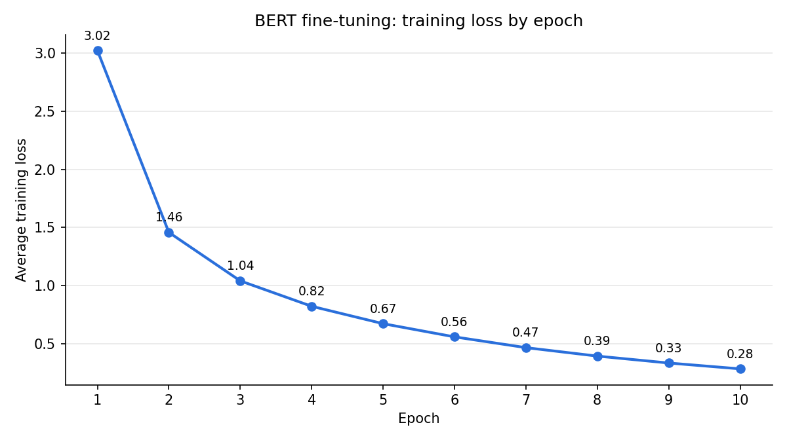

# Chinese Product Title Classification with BERT

Fine-tuning `bert-base-chinese` to classify Chinese e-commerce product titles into **715 fine-grained categories**, then applying the model to an unlabeled product list from a different platform.

## Overview

E-commerce product titles are short, noisy, and full of brand names, model numbers, and promotional text. This project trains a BERT classifier that maps a product title to its top-level category (大類) and subcategory (小類), using labeled Shopee product data.

| | |
|---|---|
| Task | Multi-class text classification (715 classes) |
| Training data | Shopee product titles with category labels (253,285 rows) |
| Model | `BertForSequenceClassification` · `bert-base-chinese` |
| Result | **78.9% test accuracy** (random baseline ≈ 0.14%) |

## Workflow

```text
Shopee product titles + labels
        ↓
Combine 大類 + 小類 into 715 subcategory labels
        ↓
Clean titles (remove bracketed text, trailing model numbers/sizes)
        ↓
Random 60% sample → 80/20 train/test split
        ↓
Tokenize with bert-base-chinese (max length 128)
        ↓
Fine-tune BERT (10 epochs, AdamW, lr = 2e-5, batch size 32)
        ↓
Evaluate on test set
        ↓
Classify an unlabeled product list (with an UNK confidence threshold)
```

## Results

### Training

Average training loss dropped from 3.02 to 0.28 over 10 epochs.



### Test accuracy

| Split | Samples | Accuracy |
|---|---|---|
| Test (20% of the 60% sample) | 30,395 | **78.86%** |

Example predictions from the test set:

| Product title | Predicted | Actual |
|---|---|---|
| 電力十足多功能電子錶 - 銀框 正版宏崑公司貨 | 手錶/男錶 | 手錶/男錶 ✅ |
| 男款長袖上衣 長袖薄恤 | 戶外與運動用品/運動上著/戶外機能上著 | 戶外與運動用品/運動上著/戶外機能上著 ✅ |
| 犀牛盾 適用邊框背蓋手機殼 / 皮克斯 - 怪獸大學 | 手機平板與周邊/手機保護周邊 | 手機平板與周邊/手機保護周邊 ✅ |
| 青青和紙生活多功能貼 - 旅行時光 | 書籍及雜誌期刊/其他 | 文具、美術用具/標籤、貼紙 ❌ |

### Applying the model to unlabeled data

The trained model was used to classify ~18.7k product titles from another platform. A prediction is labeled `UNK` when the model's top probability is below a threshold:

- At **0.9**, most products were marked `UNK` unless the title closely overlapped with a category name.
- At **0.25**, only titles too vague to categorize were marked `UNK`, so 0.25 was used.

## Error Analysis

- **Word overlap works well.** Titles sharing words with the category name (e.g. 茶, 收納櫃, 口罩) were almost always classified correctly.
- **The model generalizes beyond overlap.** Many titles with no shared words were still correct, e.g. a pain-relief spray → 保健/舒緩用品, a facial cleansing mousse → 美妝保養/洗面乳.
- **Character/IP names mislead the model.** A Snoopy-branded phone charger and a "King Kong" charging cable were classified as 愛好與收藏品/動漫周邊 and 愛好與收藏品/公仔 instead of 手機平板與周邊.
- **Fine-grained health categories are hard.** 保健 has many similar subcategories; titles rarely state the product's function, e.g. ostrich essence capsules were labeled 順暢保養食品 rather than the more fitting 機能性食品.

## Limitations & Possible Improvements

- Only overall accuracy was measured. Macro-F1, top-level category accuracy, and per-class errors would give a fuller picture, especially with 715 imbalanced classes.
- There is no separate validation set, so the number of epochs and the UNK threshold were not tuned systematically.
- The title-cleaning regex `[A-Z0-9(cm)…]+$` also removes trailing lowercase `c`/`m` characters. It is kept unchanged so the notebook matches the reported results.
- Only a random 60% of the data was used. Training on the full dataset may improve accuracy.

## Tech Stack

Python · PyTorch · Hugging Face Transformers · scikit-learn · Pandas · Jupyter Notebook (Google Colab, T4 GPU)

## Project Structure

```text
bert-chinese-product-classification/
├── README.md
├── product_classification_bert.ipynb
├── requirements.txt
├── data/
│   └── README.md
└── images/
    └── training_loss.png
```

## How to Run

1. Install the dependencies:

   ```bash
   pip install -r requirements.txt
   ```

2. Place the datasets in `data/` as described in [`data/README.md`](data/README.md).

3. Open `product_classification_bert.ipynb` and run it from top to bottom. A GPU is strongly recommended (the original run used a Colab T4).

## Data & Privacy Note

The datasets are not published in this repository. Notebook outputs showing the unlabeled product dataset (including seller information) have been removed.

## Project Context

This was a group midterm project for a university text-mining course. All team members worked together on every stage: data preprocessing, model training, evaluation, and error analysis. This repository is a cleaned-up, portfolio-oriented version of the original Colab notebook.
